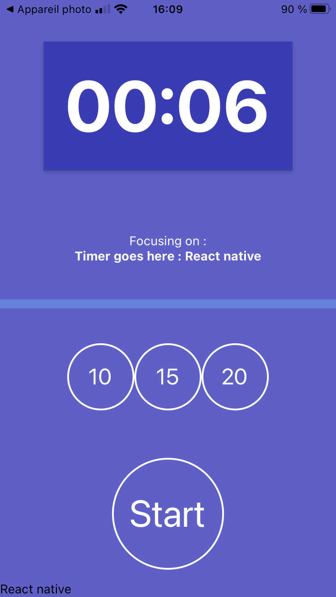

#  :hourglass: Focus Timer App

## 👉 Create an application for smartphone to stay focus on a subject !

## Illustration 📸
  

## Language/tools 🛠
- HTML5 / CSS3
- Javascript / REACT NATIVE/ Hooks
- EXPO
  

## Goals 🏔
- Discover React Native
- Discover Expo
- Discover Native components
- UX / UI

## How to use ⚙️

### ⚡️ Launch the development server & meeting on http://localhost:8080/
``` javascript
npm run start
```

### ⚡️ Run for IOS
``` javascript
npm run ios
```
### ⚡️  Run for ANDROID
``` javascript
npm run android
```
### ⚡️  Run for WEB
``` javascript
npm run web
```

## Status 📈
Project not completed

## Context 🎓
Project developed as a junior web developer

